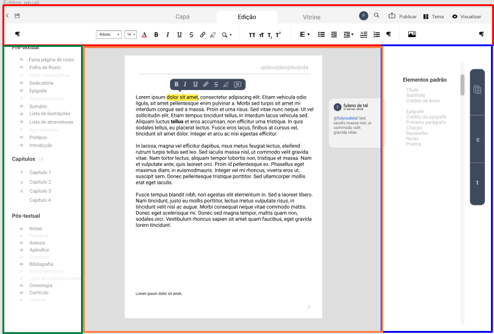
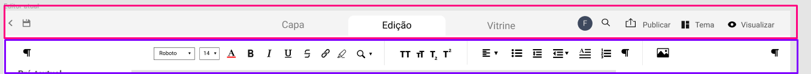
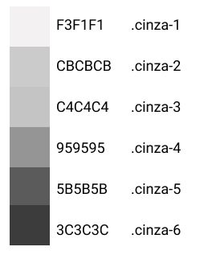

# Book-Editor
 Future Book Editor for a research project at UnB.
 Esse editor tem como objetivo ajudar pequenas editoras ou pessoas que queiram diagramar um livro de forma simples sem precisar de a contratação de um design a cada diagramação. 

## Protótipo
    https://www.figma.com/file/FO7Nj17Zxv0VxAJ3fkio8b/Book-Editor?node-id=493%3A12

## Organização do código
O código se encontra dividido por componentes: menu superior (sendo subdividido em: menu abas (superior) e menu de formatação (inferior)), menu esquerdo, menu direito e centro de edição de texto.

    Menu superior = vermelho
    Menu esquerdo = verde
    Centro de edição = laranja
    Menu direito = azul

#### divisão do menu superior

    Menu Abas = rosa
    Menu Formatação = roxo

##  Bootstrap.css
O arquivo de bootstrap são classes pré-prontas de alguns estilos que se repetem durante o sistema e está dividido nas seguintes categorias:

* inicial aplicando a font roboto em todo html (linhas 1-7)

* grid (linhas 8-17)
    Para fazer o grid trabalhei com a ideia de linhas e colunas usando flex box.
    link para saber mais sobre flex box: https://css-tricks.com/snippets/css/a-guide-to-flexbox/

* alinhamento horizontal (linhas 19-34)
    classes para alinhamento horizontal.

* alinhamento vertical (linhas 35-41)
    classes para alinhamento vertical.

* util (linhas 43-49)
    classes uteis e que não se enquandram e uma categoria especifica. 

* margins (linhas 51-120)
    classes de margin tambem dividas em todas as direções ou apenas direita, esquerda, top e bottom. 

* cores (linhas 125-143)
    classes da paleta de cores definida atualmente no figma. 
    
    
* cores background(linhas 145-163)
    classes da paleta de cores definida atualmente no figma para usar em background.

* input(linhas 166-175)
    Estilo padronizado de input. Tdos os inputs do sistema devem ter a classe input.
    Ex: ˋ<input class="input">ˋ

* botão (linhas 145-163)
    Estilo padronizado de botão. Tdos os botoẽs do sistema devem ter a classe btn.
    Ex: ˋ<button class="btn"></button>ˋ

## Issues
    Issues são algumas tarefas que ainda não estão implementadas. 

#### Geral

* revisar mini bootastrap, adicionar classes necessárias e organizar o arquivo. (in progress)

#### Menu superior (menu abas)

* Adicionar css de aba ativa

#### Menu superior (menu formatação)

* Pesquisar e adicionar na barra de formatação a opção de troca de fonte e tamanho de texto. 
* Adicionar 8 itens faltantes na barra de formatação (procurar se o Quill disponibiliza todas as funções)
* adicionar divisores que separam o icones

#### Menu esquerdo

* Criar interação de ligar e desligar elementos. 

#### Centro de edição

* adicionar cabeçalho na pagina
* adicionar barra de edição flutuante
    aparentemente não é possivel colocar duas toolbars (https://quilljs.com/docs/modules/toolbar/). Porém me lembro de colcoar em código passados, perguntar na orientação.
* programação adição de nova página ao escrever mais que uma página

#### Menu direito

* adicionar barra azul flutuante (Não foi feita a adição ainda pois Luis e Luanda ainda irão refinar ele um pouco mais)
